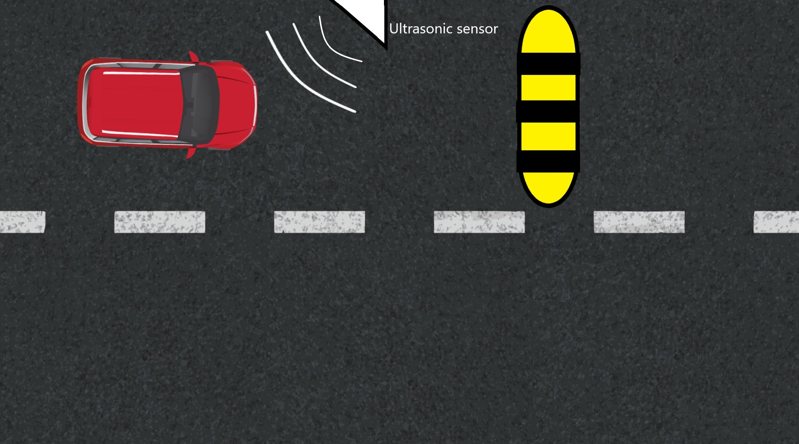
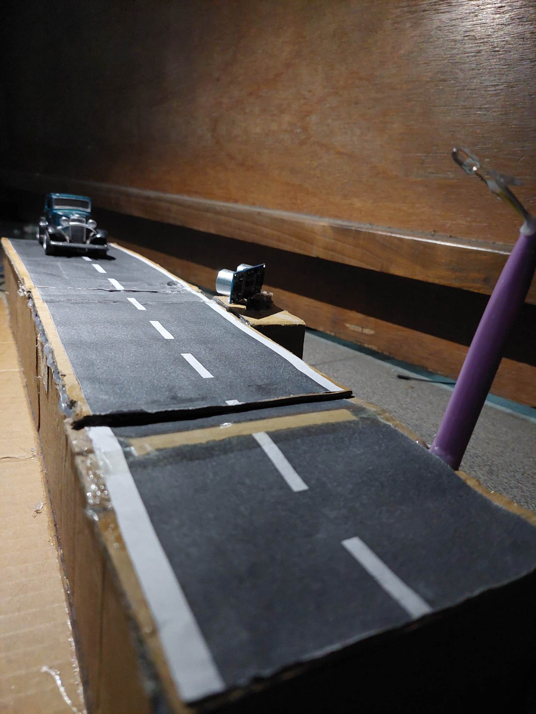

# Smart-vehicle-speed-limit-enforcement-system
This project proposes an effective system for highways of Bangladesh for issuing the traffic violation ticket to those who drives their vehicle above the speed limit and become vulnerable for other vehicles.
## Report
Find the detailed report of this project [here](https://drive.google.com/file/d/1C9klFF9NPafh3TaHL1QkwQMa4UdmGjHe/view?usp=drivesdk)
## Images

## Demo
Find demo video at this [link](https://youtu.be/8oNjW7YFhG8?si=ggvG3d1rfU0_CTpe)
